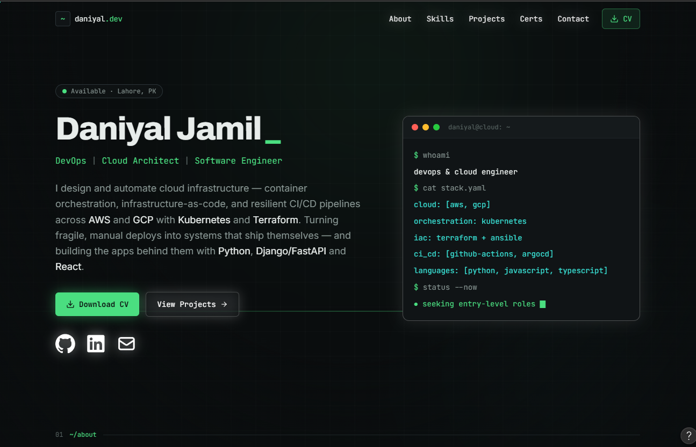

# ⚡ Daniyal Jamil — DevOps & Cloud Engineer Portfolio

[](https://vercel.com)
[](https://react.dev/)
[](https://tailwindcss.com/)
[](https://vitejs.dev/)
[](https://www.typescriptlang.org/)

> A high-performance, modern, and interactive portfolio designed for **DevOps & Cloud Engineers**. Use this repository as a battle-tested template or reference implementation for showcasing cloud infrastructure, CI/CD pipelines, containerization projects, and full-stack capabilities.
>
> 

---
 *********************************************************                   Live at https://daniyal-portfolio-one.vercel.app/                   ******************************************************************************************


 
## 🌟 Overview

Welcome to my personal portfolio repository! I'm **Daniyal Jamil**, a passionate **DevOps & Cloud Engineer** specializing in automated infrastructure, cloud solutions (AWS & GCP), Kubernetes orchestration, robust CI/CD pipelines, and modern full-stack development.

This portfolio is built from the ground up with cutting-edge web technologies, offering a sleek dark futuristic design, fluid animations, interactive project showcases, and categorized skill matrices.

---

## 📸 Portfolio Showcase

Here is a visual tour of the revamped portfolio:

### 1. Hero & Profile Overview

*Dynamic futuristic hero section featuring animated background particle effects, quick social links, bio highlights, and smooth scroll navigation.*

---

### 2. Interactive Skills Matrix & Core Competencies

*Categorized technology stack featuring Cloud & Infrastructure (AWS, GCP, K8s, Docker, Terraform), CI/CD & Automation (GitHub Actions, GitLab CI, Ansible, ArgoCD), Backend, Frontend, and Development tools with custom icons and interactive hover states.*

---

### 3. Featured DevOps & Cloud Projects

*Curated grid of production-grade projects including automated Kubernetes clusters, multi-region AWS architectures, GitOps deployment pipelines, and serverless microservices.*

---

### 4. Interactive Project Deep-Dive & Certificates

*Detailed project showcase modal featuring in-depth technical breakdowns, architecture highlights, key features, technology badges, and live demo / source links alongside verified professional certifications.*

---

## 🛠 Tech Stack

### Frontend & UI Architecture
- **Framework**: [React 19](https://react.dev/) with TypeScript
- **Styling**: [Tailwind CSS v4](https://tailwindcss.com/)
- **Animations**: [Motion](https://motion.dev/) (Framer Motion)
- **Icons**: [React Icons](https://react-icons.github.io/react-icons/) (FontAwesome, Simple Icons, Remix Icons)
- **Build Tool**: [Vite 8](https://vitejs.dev/)

### Core Engineering Focus Areas
| Domain | Technologies & Tools |
| :--- | :--- |
| **Cloud Infrastructure** | AWS, Google Cloud Platform (GCP), Kubernetes, Docker, Terraform, Linux |
| **CI/CD & GitOps** | GitHub Actions, GitLab CI, Ansible, ArgoCD |
| **Backend & APIs** | Python, Django, FastAPI, Node.js, REST APIs, MySQL |
| **Frontend & Web** | React, TypeScript, HTML5, CSS3, Tailwind CSS |
| **Version Control** | Git, GitHub, GitLab |

---

## ✨ Key Features

- 🚀 **Interactive Project Showcase**: Deep-dive modals for each project displaying architecture, key achievements, and code snippets.
- ⚡ **Dynamic Skill Matrix**: Grouped technical skills with custom brand icons and visual accent colors.
- 🌌 **Futuristic Canvas Background**: Smooth, lightweight canvas particle effect enhancing visual aesthetics without degrading performance.
- 📜 **Scroll Progress Bar**: Real-time progress bar reflecting current scroll positioning.
- 📱 **Fully Responsive**: Flawlessly optimized across desktop, tablet, and mobile displays.
- 🛡️ **TypeScript Strict Mode**: Fully typed codebase ensuring reliability and maintainability.

---

## 🚀 Getting Started

### Prerequisites
Make sure you have Node.js (v18+) installed on your machine.

### Installation

1. **Clone the repository**:
   ```bash
   git clone https://github.com/Daniyal-Jamil-2005/Daniyal-Portfolio.git
   cd Daniyal-Portfolio
   ```

2. **Install dependencies**:
   ```bash
   npm install
   ```

3. **Start local development server**:
   ```bash
   npm run dev
   ```
   Open your browser and navigate to `http://localhost:5173`.

4. **Build for production**:
   ```bash
   npm run build
   ```
   The production-ready assets will be generated in the `dist/` directory.

---

## 🌐 Deploying to Vercel

This repository is pre-configured for instant deployment on [Vercel](https://vercel.com).

### Option 1: Deploy via Vercel Dashboard (Recommended)
1. Push your changes to GitHub.
2. Go to [Vercel Import Project](https://vercel.com/new).
3. Select your `Daniyal-Portfolio` repository.
4. Framework Preset will automatically detect **Vite**.
5. Click **Deploy**.

### Option 2: Deploy via Vercel CLI
```bash
npm install -g vercel
vercel
```

---

## 👤 Author & Contact

**Daniyal Jamil**  
*DevOps & Cloud Engineer*

- 💼 **LinkedIn**: [Daniyal Jamil](https://linkedin.com)
- 🐙 **GitHub**: [@Daniyal-Jamil-2005](https://github.com/Daniyal-Jamil-2005)

---

⭐ **Feel free to star this repository if you find it helpful as an example for your own portfolio!**
